# Battalion Call Graph

```mermaid
flowchart TB
    %% Style definitions
    classDef mainNode fill:#90EE90,stroke:#333,stroke-width:2px
    classDef coreNode fill:#FFFFE0,stroke:#333,stroke-width:2px
    classDef inputNode fill:#FFB6C1,stroke:#333,stroke-width:2px
    classDef renderNode fill:#E0FFFF,stroke:#333,stroke-width:2px
    classDef gameNode fill:#F5DEB3,stroke:#333,stroke-width:2px
    classDef utilNode fill:#D3D3D3,stroke:#333,stroke-width:2px

    %% Nodes
    main[main]:::mainNode
    
    doUpdate[doUpdate]:::coreNode
    doDisplay[doDisplay]:::coreNode
    id[id]:::coreNode
    initialization[initialization]:::coreNode
    
    checkInput[checkInput]:::inputNode
    processKey[processKey]:::inputNode
    demoKeys[demoKeys]:::inputNode
    playKeys[playKeys]:::inputNode
    playNoPauseKeys[playNoPauseKeys]:::inputNode
    checkMouse[checkMouse]:::inputNode
    
    doDrawing[doDrawing]:::renderNode
    goToMonsterView[goToMonsterView]:::renderNode
    goToArmyView[goToArmyView]:::renderNode
    goToMapView[goToMapView]:::renderNode
    goToOverView[goToOverView]:::renderNode
    goto3d[goto3d]:::renderNode
    goto1d[goto1d]:::renderNode
    
    updateProjectiles[updateProjectiles]:::gameNode
    updateTargets[updateTargets]:::gameNode
    updateBooms[updateBooms]:::gameNode
    updateSlagTanks[updateSlagTanks]:::gameNode
    updatetrees[updatetrees]:::gameNode
    updateDeadMonster[updateDeadMonster]:::gameNode
    updateVapourLook[updateVapourLook]:::gameNode
    
    cleanup[cleanup]:::utilNode
    setPlayConditions[setPlayConditions]:::utilNode
    addRandomTarget[addRandomTarget]:::utilNode
    addBoom[addBoom]:::utilNode
    addScore[addScore]:::utilNode
    checkForBlock[checkForBlock]:::utilNode
    quickTanks[quickTanks]:::utilNode
    updateScores[updateScores]:::utilNode
    buildHillPart[buildHillPart]:::utilNode
    goToHighDetail[goToHighDetail]:::utilNode
    goToLowDetail[goToLowDetail]:::utilNode
    showCommands[showCommands]:::utilNode
    signal_handler[signal_handler]:::utilNode
    autopilot[autopilot]:::utilNode
    addProjectile[addProjectile]:::utilNode
    drawAMonster[drawAMonster]:::utilNode
    setmonitor[setmonitor]:::utilNode
    addNewTank[addNewTank]:::utilNode
    updateTanks[updateTanks]:::utilNode

    %% Edges
    addRandomTarget --> addProjectile
    checkInput --> goto1d
    checkInput --> goto3d
    demoKeys --> setPlayConditions
    doDisplay --> doDrawing
    doDrawing --> drawAMonster
    doDrawing --> goToArmyView
    doDrawing --> goToMapView
    doDrawing --> goToMonsterView
    doDrawing --> goToOverView
    doUpdate --> addNewTank
    doUpdate --> addProjectile
    doUpdate --> addRandomTarget
    doUpdate --> checkForBlock
    doUpdate --> quickTanks
    doUpdate --> setPlayConditions
    doUpdate --> updateBooms
    doUpdate --> updateDeadMonster
    doUpdate --> updateProjectiles
    doUpdate --> updateScores
    doUpdate --> updateSlagTanks
    doUpdate --> updateTanks
    doUpdate --> updateTargets
    doUpdate --> updateVapourLook
    doUpdate --> updatetrees
    goto1d --> setmonitor
    id --> autopilot
    id --> checkMouse
    id --> doDisplay
    id --> doUpdate
    initialization --> cleanup
    initialization --> goToHighDetail
    main --> cleanup
    main --> initialization
    main --> setPlayConditions
    main --> showCommands
    processKey --> cleanup
    processKey --> demoKeys
    processKey --> goToHighDetail
    processKey --> goToLowDetail
    processKey --> goto1d
    processKey --> playKeys
    processKey --> playNoPauseKeys
    setPlayConditions --> addNewTank
    setPlayConditions --> buildHillPart
    setPlayConditions --> quickTanks
    showCommands --> cleanup
    signal_handler --> cleanup
    updateBooms --> addScore
    updateDeadMonster --> addProjectile
    updateProjectiles --> addBoom
    updateProjectiles --> addScore
    updateSlagTanks --> addBoom
    updateSlagTanks --> addProjectile
    updateSlagTanks --> checkForBlock
    updateSlagTanks --> quickTanks
    updateTargets --> updateDeadMonster
    updateTargets --> updateVapourLook
    updatetrees --> addProjectile
```

## Legend
- **Green**: Main entry point
- **Yellow**: Core update/display functions
- **Pink**: Input handling functions
- **Cyan**: Rendering/view functions
- **Wheat**: Game logic update functions
- **Gray**: Utility functions
