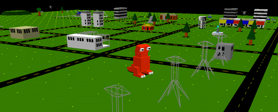
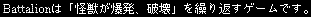
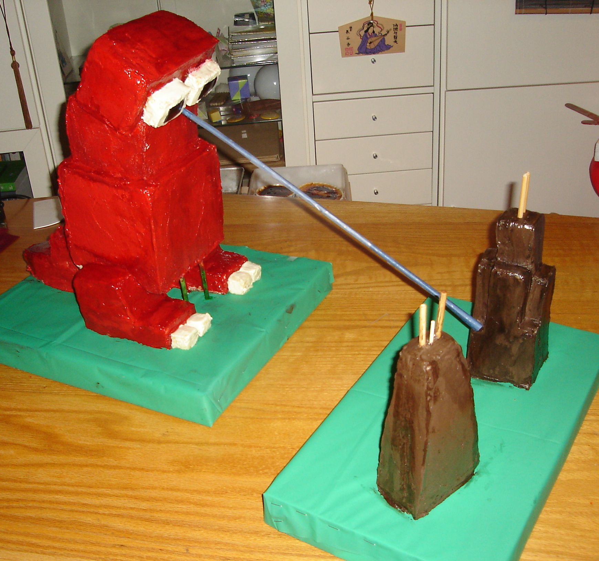
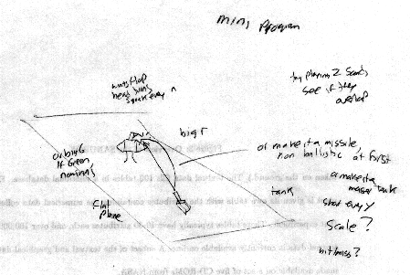
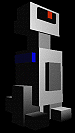
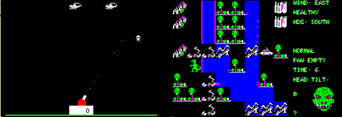
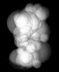

= The 2nd Battalion Page
ifndef::env-github[:icons: font]
:note-caption: :paperclip:
:important-caption: :exclamation:
:warning-caption: :warning:

[IMPORTANT]
====
This is an inofficial copy of Andrew Johnson's webpage and sourccode archives provides there. 
====

"Monsters, explosions, senseless destruction. You've seen the movies, you know what to do."

_battalion_ was a game written in 1994 on my Silicon Graphics Indy in GL
for the IndiZone 3 contest as a way for me to unwind after completing my
PhD. This version also ran in the CAVE(tm) as a virtual reality game and
was first publically shown at the EVE 4 art show in May 1995. The GL
version won 'best indy software' at IndiZone 3 and was made available on
the Indizone3 CDROM.

I converted battalion to OpenGL (with several enhancements) and modified
it to work with the MESA graphics library in late 1996. In 1997 it won
the Hot Mix 17 game contest from SGI, and was available on the Hot Mix
17 CDROM. In 1999 I upgraded the CAVE version to OpenGL so it would run
on SGI, Linux, and HP powered CAVES and ImmersaDesks.

The desktop version was ported to a variety of platforms by myself and
others: Suns under SunOS 4 and Solaris 2, under Linux, on HP
workstations, under AIX, under OpenVMS, on the Macintosh, on Windows 95
and the BeOS. My latest enhancements to the desktop versions were the
classic and carbon macintosh versions, and a Windows 95/NT/98/xp
version.

After a few years hiatus I have come back to my original code and
decided to port it to the iPhone ... which has about the equivalent
OpenGL graphics power to my SGI indy from 1995.

__battalion__ 1.9 for the iPhone and iPad

'''''

Here is the description of _battalion_ from the Silicon Graphics
homepage in Japan.

 +
Battalion wa 'kaiju ga bakuhatsu, hakai' wo kuri-kaesu game desu. +
Battalion is a game where 'A monster blows up, destroys' repeats. +
... pretty much says it all ...

'''''

Here is a battalion themed cake from 2005, made by Chris Vasilakis.
yummy.

'''''

I wanna play! / Ich will es spielen! Je veux jouer! /  +
Voglio giocare! /  Zelim se igrati / Quiero jugar!

Here are the various versions of battalion that you can download.

[WARNING]
====
Many of these were compiled several years ago so I'm not sure what will
happen if you try to run them, or even if they will still run. As of
2009 the only currently supported version of the game is on the iPhone
and iPad, though I fixed the linux version in the summer of 2010 so that
should still run.
====

This software is provided 'as is' without any warrenty whatsoever.
Googelon. Flutter, Techs, the Vapour, and I disclaim any bad things that
may happen to you, your loved ones, your co-workers, your pets, your
social life, or your electronic equipment as the result of downloading
and playing this game ... so if you go on a shooting rampage at a
fast-food restaurant please don't blame me.

original out-of-date, classic battalion in GL for Silicon Graphics Workstations +

battalion 1.3 in OpenGL for Silicon Graphics Workstations, IRIX 5.3 or newer +

__battalion__ 1.5.3 for OS-X*

_battalion_ 1.5 for Windows +

Unfortunately under OS-X these days the sounds and the music are no
longer working. I'll see about fixing that ... +

_battalion_ 1.3 for Sun with SunOS 4

_battalion_ 1.3 for Sun with Solaris +

_battalion_ for Linux with improvements by Andrew from ntlworld.com, Eero Tamminen and Simon Boggis +

__battalion__ 1.3 for AIX PPC

_battalion_ 1.3 for AIX RS6000 +

__battalion__ 1.3 for BeOs by Ed Silva

_battalion_ 1.4 for NetBSD +

another version of _battalion_ for Linux and Windows by Jaime Alemany +

more data files for _battalion_ by Kasper Werther

'''''

[cols="1,5", frame=none, grid=none]
|===
^.^| 
.^| 
For many years I have wanted to make a strategy game where you would play the army and deploy forces and allocate resources to combat the attacking giant monsters.
When the indizone contest came along it was obvious that such a game was not appropriate but that an arcade version of the concept would work.

A major inspiration for the look of the game came while I was watching
my Japanese laserdisc of 'Radon' (This version lacks the unending
naration of the American version, and all of the people in Japan do not
sound like either George Takei or Keye Luke.) While watching the battle
between the Radons and the army in Sasebo I started making some drawings
and that led to the game.

The idea of playing the army quickly faded as it would have been
extremely difficult to control all of the various units involved, so the
player was soon playing the monster. And after all, you always did want
to be the monster when you were a kid. When I decided to make the game
look like the kind of battle children would have with plastic monsters
on a model railroad the style of the game all fell into place. I also
wanted to make the kind of game that Calvin (from Calvin and Hobbes)
would love to play ... though he would probably also want to be able to
crush the fleeing citizens.
|===

The one other requirement for the game was that I wanted to have what I
dubbed the 'MechaGodzilla firestorm' from the two 1970's MechaGodzilla
movies, where there were pyrotechnics and coloured rays shooting all
over the place. MechaGoogelon originally was to play that role, but I
thought adding a hero (a non-denominational Ultraman, UltraSeven,
Mirror-Man, pick your favorite) was better suited that purpose ... and
its just fun to fight the hero.

[cols="1,5", frame=none, grid=none]
|===
^.^| 
.^| 

Aside from the obvious movie and TV influences, _battalion_ was influenced by two of my favorite old apple ][ games: Jon Freeman's 'Crush, Crumble, and Chomp: the Movie Monster Game' and Mark Allen's 'Sabotage!'

CC&C was a strategy game where you played a movie monster in a major
city, eating people, fighting the national guard, trying to avoid
stepping on power plants, and keeping a sharp eye out for the mad
scientist in his helicopter.

Sabotage was the original(?) 'lone gun emplacement beseiged by
paratroopers' game which has since been reincarnated many times on many
different platforms.
|===

'''''

== Announcements:

10/31/01::
The OS-X version of battalion got a colour 1/4 page mention in the November 2001 issue of MacPower magazine in Japan and appears on the CDROM in that issue.
Thanks to the MacPower people for sending me a copy of the issue. Scans of that page are link:images/macpower112001med.jpg[here] and link:images/macpower112001small.jpg[here].

5/31/01::
The Macintosh version is currently also available on apple's OS-X software site (www.apple.com/downloads/macosx/) in the Games and Hobbies section.

8/25/99::
battalion got a 1/4 page mention in the September issue of MacPower magazine in Japan. Scans of the page are located
link:images/macpower1.jpg[here] and link:images/macpower2.jpg[here].

12/15/97::
battalion is now shipping as part of S.U.S.E. Linux

10/1/97::
battalion is now shipping as part of Sun Microsystems' 'Ultra Pack Volume 2' CDROM distributed with each Ultra Creator / Creator 3D system shipped

8/9/97::
battalion won the Creator Program games contest from Silicon Graphics, and is now included on the HotMix 17 CDROM from SGI.

'''''

[cols="1,5,1", frame=none, grid=none, width="100%"]
|===
^.^| 

|
I want to thank the members of the Electronic Visualization Lab for all
their helpful suggestions during the development of this game (though
almost all of the suggestions were 'give us more stuff to blow up').

I also want to thank Ray Harreyhausen, Eiji Tsubaraya, and all the
others who perform magic with pieces of rubber and plastic.
^.^|

|===
'''''

[cols="10%,~", frame=none, grid=none]
|===
^.^| 
.^| Copyright © Andrew Johnson 1995-2023
|===
